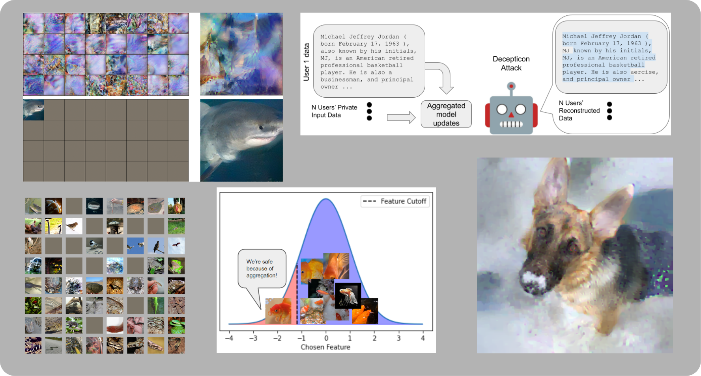

# Breaching - A Framework for Attacks against Privacy in Federated Learning

This PyTorch framework implements a number of gradient inversion attacks that *breach* privacy in federated learning scenarios,
covering examples with small and large aggregation sizes and examples both vision and text domains.




This includes implementations of recent work such as:
* Malicious-model attacks as described in "Robbing The Fed" https://openreview.net/forum?id=fwzUgo0FM9v
* Attacks against transformer architectures described in "Decepticons" https://arxiv.org/abs/2201.12675
* Fishing attacks that breach arbitrary aggregations described in https://arxiv.org/abs/2202.00580

But also a range of implementations of other attacks from optimization attacks (such as "Inverting Gradients" and "See through Gradients") to recent analytic and recursive attacks. Jupyter notebook examples for these attacks can be found in the `examples/` folder.

## Overview:
This repository implements two main components. A list of modular attacks under `breaching.attacks` and a list of relevant use cases (including server threat model, user setup, model architecture and dataset) under `breaching.cases`. All attacks and scenarios are highly modular and can be customized and extended through the configuration at `breaching/config`.

### Installation
Either download this repository (including notebooks and examples) directly using `git clone` or install the python package via `pip install breaching` for easy access to key functionality.

Because this framework covers several use cases across vision and language, it also accumulates a kitchen-sink of dependencies. The full list of all dependencies can be found at `environment.yml` (and installed with conda by calling `conda env create --file environment.yml `), but the full list of dependencies not installed by default. Install these as necessary (for example install huggingface packages only if you are interested in language applications).

You can verify your installation by running `python simulate_breach.py dryrun=True`. This tests the simplest reconstruction setting with a single iteration.


### Usage
You can load any use case by
```
cfg_case = breaching.get_case_config(case="1_single_imagenet")
user, server, model, loss = breaching.cases.construct_case(cfg_case)
```
and load any attack by
```
cfg_attack = breaching.get_attack_config(attack="invertinggradients")
attacker = breaching.attacks.prepare_attack(model, loss, cfg_attack)
```

This is a good spot to print out an overview over the loaded threat model and setting, maybe you would want to change some settings?
```
breaching.utils.overview(server, user, attacker)
```

To evaluate the attack, you can then simulate an FL exchange:
```
shared_user_data, payloads, true_user_data = server.run_protocol(user)
```
And then run the attack (which consumes only the user update and the server state):
```
reconstructed_user_data, stats = attacker.reconstruct(payloads, shared_user_data)
```

For more details, have a look at the notebooks in the `examples/` folder, the cmd-line script `simulate_breach.py` or the minimal examples in `minimal_example.py` and `minimal_example_robbing_the_fed.py`.

### What is this framework?
This framework is modular collections of attacks against federated learning that breach privacy by recovering user data from their updates sent to a central server. The framework covers gradient updates as well as updates from multiple local training steps and evaluates datasets and models in language and vision. Requirements and variations in the threat model for each attack (such as the existence of labels or number of data points) are made explicit. Modern initializations and label recovery strategies are also included.

We especially focus on clarifying the threat model of each attack and constraining the `attacker` to only act based on the `shared_user_data` objects generated by the user. All attacks should be as use-case agnostic as possible based only on these limited transmissions of data and implementing a new attack should require no knowledge of any use case. Likewise implementing a new use case should be entirely separate from the attack portion. Everything is highly configurable through `hydra` configuration syntax.

### What does this framework not do?
This framework focuses only on attacks, implementing no defense aside from user-level differential privacy and aggregation. We wanted to focus only on attack evaluations and investigate the questions "where do these attacks work currently", and "where are the limits". Accordingly, the FL simulation is "shallow". No model is actually trained here and we investigate fixed checkpoints (which can be generated somewhere else). Other great repositories, such as https://github.com/Princeton-SysML/GradAttack focus on defenses and their performance during a full simulation of a FL protocol.


### Attacks
A list of all included attacks with references to their original publications can be found at `examples/README.md`.

### Datasets
Many examples for vision attacks show `ImageNet` examples. For this to work, you need to download the *ImageNet ILSVRC2012* dataset **manually**. However, almost all attacks require only the small validation set, which can be easily downloaded onto a laptop and do not look for the whole training set. If this is not an option for you, then the `Birdsnap` dataset is a reasonably drop-in replacement for ImageNet. By default, we further only show examples from `ImageNetAnimals`, which are the first 397 classes of the ImageNet dataset. This reduces the number of weird pictures of actual people substantially. Of course `CIFAR10` and `CIFAR100` are also around.
For these vision datasets there are several options in the literature on how to partition them for a FL simulation. We implement a range of such partitions with `data.partition`, ranging from `random` (but replicable and with no repetitions of data across users), over `balanced` (separate classes equally across users) to `unique-class` (every user owns data from a single class). When changing the partition you might also have to adjust the number of expected clients `data.default_clients` (for example, for `unique_class` there can be only `len(classes)` many users).

For language data, you can load `wikitext` which we split into separate users on a per-article basis, or the `stackoverflow` and `shakespeare` FL datasets from tensorflow federated, which are already split into users (installing `tensorflow-cpu` is required for these tensorflow-federated datasets).

Further, nothing stops you from skipping the `breaching.cases` sub-module and using your own code to load a model and dataset. An example can be found in `minimal_example.py`.

## Metrics

We implement a range of metrics which can be queried through `breaching.analysis.report`. Several metrics (such as CW-SSIM and R-PSNR) require additional packages to be installed - they will warn about this. For language data we hook into a range of huggingface metrics. Overall though, we note that most of these metrics give only a partial picture of the actual severity of a breach of privacy, and are best handled with care.

## Additional Topics

### Benchmarking
A script to benchmark attacks is included as `benchmark_breaches.py`. This script will iterate over the first valid `num_trials` users, attack each separately and average the resulting metrics. This can be useful for quantitative analysis of these attacks. The default case takes about a day to benchmark on a single GTX2080 GPU for optimization-based attacks, and less than 30 minutes for analytic attacks.
Using the default scripts for benchmarking and cmd-line executes also includes a bunch of convenience based mostly on `hydra`. This entails the creation of separate sub-folders for each experiment in `outputs/`. These folders contain logs, metrics and optionally recovered data for each run. Summary tables are written to `tables/`.

### System Requirements
All attacks can be run on both CPU/GPU (any `torch.device` actually). However, the optimization-based attacks are very compute intensive and using a GPU is highly advised. The other attacks are cheap enough to be run on CPUs (The Decepticon attack for example does most of the heavy lifting in assignment problems on CPU anyway, for example).

### Options
It is probably best to have a look into `breaching/config` to see all possible options.

### Citation
For now, please cite the respective publications for each attack and use case and note in your appendix / supplementary material that you used this framework.


### License
We integrate several snippets of code from other repositories and refer to the licenses included in those files for more info.
We're especially thankful for related projects such as https://www.tensorflow.org/federated, https://github.com/NVlabs/DeepInversion, https://github.com/JunyiZhu-AI/R-GAP, https://github.com/facebookresearch/functorch, https://github.com/ildoonet/pytorch-gradual-warmup-lr and https://github.com/nadavbh12/VQ-VAE from which we incorporate components.

For the license of our code, refer to `LICENCE.md`.

### Authors
This framework was built by me ([Jonas Geiping](https://github.com/JonasGeiping)), [Liam Fowl](https://github.com/lhfowl) and [Yuxin Wen](https://github.com/YuxinWenRick) while working at the University of Maryland, College Park.

### Contributing
If you have an attack that you are interested in implementing in this framework, or a use case that is interesting to you, don't hesitate to contact us or open a pull-request.

### Contact
If you have any questions, also don't hesitate to open an issue here on github or write us an email.
